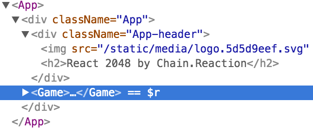

# A simple 2048 clone made with React

This project was intentionally created for a workshop held at [JSconf Belgium](https://www.jsconf.be/en/).

```
Starting development in React used to be a hard task,
but building something from scratch is now easier than ever.

In this workshop we will create a simple game step by step
focusing on creating the proper components,
organizing the code and make it as smooth as possible.
```

This writing covers the steps to follow the workshop's material.

## Getting started

### Requirements
To go on with this tutorial, you'll need:
- installed nodejs & npm

### Introduction
This workshop was held by [Chain.Reaction](http://chainreaction.io).
We're a Budapest based software agency helping adventurous entrepreneurs building their product from ground up. We're working with only javascript technologies, `nodejs` for backend, `React` for frontend and `React Native` for mobile products.

### React basics

Building something in React needs thinking with `Components`. Every little block of a React application will be (or could be) a separate component, that have its own `state` and responsible for `render`ing itself based on that. Components can render other components, this way ensuring the reusability of your code. A parent component can pass specific data to its' children components as `props`. [More info](https://facebook.github.io/react/docs/components-and-props.html)

React comes with a great javascript extension called `JSX` for describing how the UI will look like. At first glance it will seem to be some sort of mixture of js and html as a template language. JSX will produce actual React components, while keeping your code structure as the resulted html. [More info](https://facebook.github.io/react/docs/introducing-jsx.html)

## The Workshop

### Initializing the project
Since React is a complex frontend framework it needs a lot of packages and a build pipeline to get started. At first you had to setup a bunch of stuff just to get your environment working. Luckily now you can create a fully configured boilerplate with just one line (and an installed npm package called [Create React App](https://github.com/facebookincubator/create-react-app)):

```
npm install -g create-react-app
create-react-app my-2048
```

Now you can enter the generated project, start the development server and start coding:

```
cd my-2048
npm start
```

Now you can modify for example the `App.js` and checkout the build pipeline in working:
- Change the main title in the `h2` tag and see if it changed
- Let's put the name of our app there:

```jsx
<h2>React 2048 by Chain.Reaction</h2>
```

### Your first Component

Let's create a new file where we will keep our main Game related stuff, so lets call it `Game.js`. At first just create a skeleton component:

```jsx
import React, { Component } from 'react'

class Game extends Component {
  render() {
    return (
      <p className="App-intro">
        To get started, edit <code>src/App.js</code> and save to reload.
      </p>
    )
  }
}

export default Game
```

The most important part of a component is the `render` method, which will actually produce the looks of it. Note that render must return only one node, inside of it you can have any number of them, but the return value should be only one.

Now for trying out our new component, let's move the lower paragraph from the `App` to be rendered here (that's already in the snippet), and replace rendering it in the `App` with rendering the `Game` component.

```jsx
render() {
  return (
    <div className="App">
      <div className="App-header">
        
        <h2>React 2048 by Chain.Reaction</h2>
      </div>
      <Game />
    </div>
  )
}
```

If you want to use another component somewhere don't forget to import it at the top of the file:

```jsx
import Game from './Game.js'
```

Now if everything went well you should be seeing the same in your browser, just using the two separate components in the background. The html structure should be the same, but you can check that actually the `Game` component is used now with [React Devtools](https://chrome.google.com/webstore/detail/react-developer-tools/fmkadmapgofadopljbjfkapdkoienihi?hl=en)



### An empty board

The game will have a 4x4 board containing tiles, so that's a good guess if imagine that this will be our game's state. The state is also an important part of the components, since if a component's state changes react will re-render the necessary parts of the component. This will be a regular javascript object with any number of keys or level of depth. In order to help react doing it's rerendering magic, you have to consider this object as immutable (most of the time react explicitly notifies you if you try to modify the state object, but have this in mind, not all the time)

So let's initialize our game state with an empty board in the component's constructor:

```jsx
class Game extends Component {
  constructor() {
    super()
    this.state = {
      board: [[0,0,0,0],
              [0,0,0,0],
              [0,0,0,0],
              [0,0,0,0]]
    }
  }
  render() {
    ...
```

Note that this is the only place where we can set the state like this, and also nothing can happen before calling the `super()` parent class' constructor.

Now let's do some rendering. In the `Game.js` render method just map through the `board` and display it with the indices in a paragraph element. Inside of `jsx` elements you can simply have any kind of javascript code using curly braces.

```jsx
render() {
  return (
    <div className="board">
      {
        this.state.board.map((row, x) => (
          row.map((tile, y) => <p>{`[${x}][${y}]:${tile}`}</p>)
        ))
      }
    </div>
  )
}
```

Note that there are some differences compared to html, the css classes are assigned with the `className` attribute.

### Boarding the board

It really doesn't look like a board, does it?

Let's change that!

The simplest solution is to have the board positioning as relative and the paragraphs as absolute so we can dinamically pass the proper left and right values based on the indices. First create a method that returns the correct styling object based on the parameters:

```jsx
  ...
}
getPositionStyle(x, y) {
  return {
    left: x*100,
    right: y*100
  }
}
render() {
  ...
```

Then use it in the render method as the style property of the paragraphs:

```jsx
<p style={this.getPositionStyle(x, y)}>{`[${x}][${y}]:${tile}`}</p>
```

Now create a `Game.css`

```css
.board {
  width: 400px;
  height: 400px;
  position: relative;
}

.board p {
  position: absolute;
  width: 100px;
  height: 100px;
}
```

And add it to the `Game` component

```jsx
import './Game.css'
```
